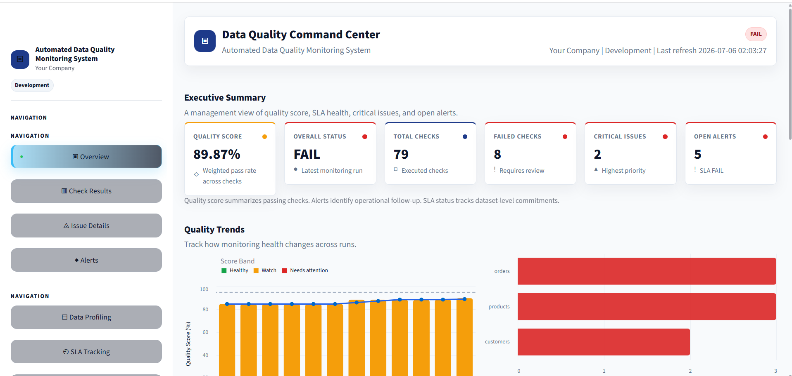
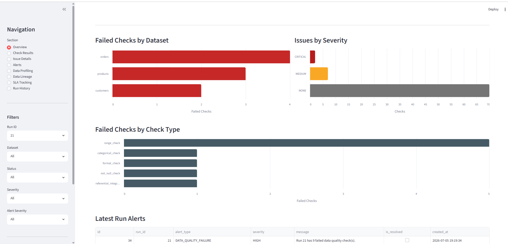
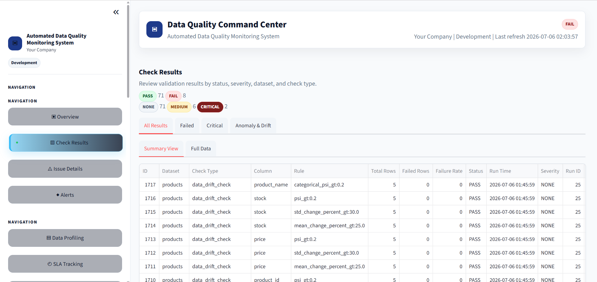
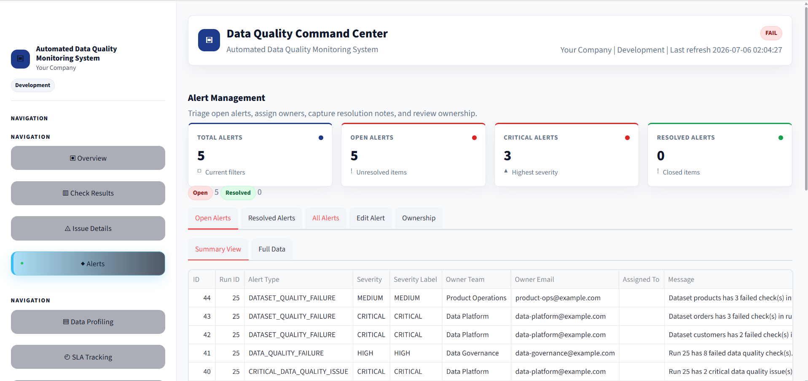
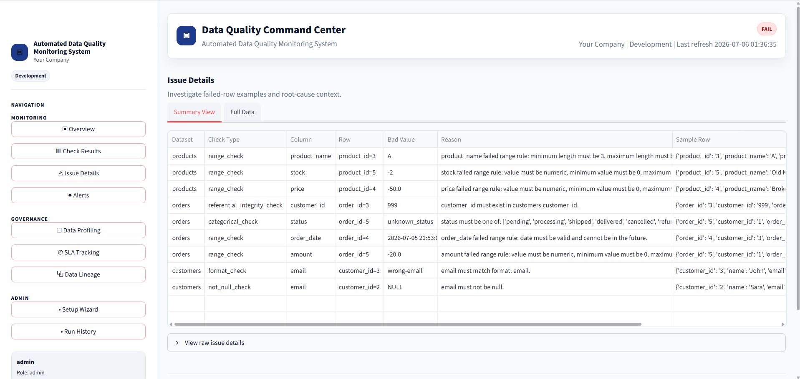
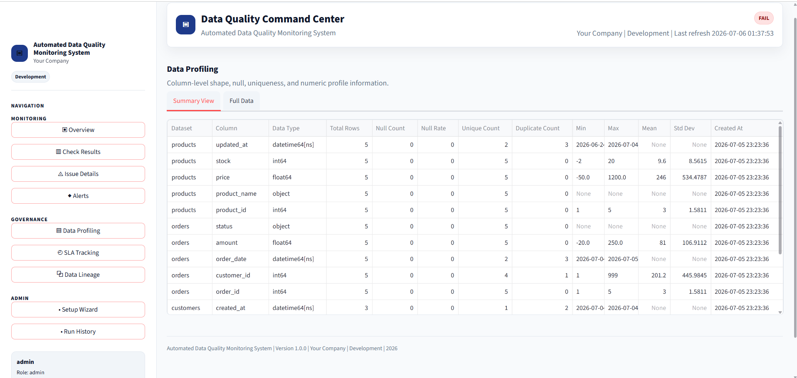
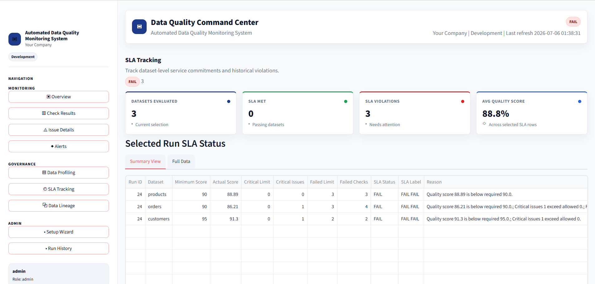

# Automated Data Quality Monitoring System

Automated Data Quality Monitoring System is a Python portfolio project for validating PostgreSQL data with configurable YAML rules, storing run history, tracking issue details, generating alerts, and visualizing data health in a Streamlit dashboard.

The project is designed to be beginner-friendly while still showing professional data engineering and data governance practices: safe configuration handling, modular checks, logging, tests, Docker support, CI, and optional API access.

## Key Features

- Config-driven quality rules in `config/rules.yaml`
- PostgreSQL integration with SQLAlchemy
- Automated checks for completeness, uniqueness, validity, freshness, consistency, and range accuracy
- Failed-row issue details for root cause analysis
- Data lineage metadata for source-table relationships
- Historical SLA tracking for dataset quality targets
- Role-based alert ownership with assignment and resolution notes
- Alert generation, Slack/Teams/email notifications, and alert resolution from the dashboard
- Dashboard authentication with environment-based credentials
- Enterprise UI theme, branded header/sidebar, light/dark mode, and customizable assets
- Streamlit dashboard with filters, charts, run history, profiling, lineage, and exports
- Data profiling for column-level statistics
- Basic anomaly detection plus profile-based drift monitoring with mean, standard deviation, PSI, and category distribution checks
- Quality scoring and severity classification
- CLI shortcuts for common commands
- PostgreSQL and Amazon Redshift source extraction support
- Optional FastAPI backend
- Optional Apache Airflow DAG for daily orchestration
- Docker Compose setup with PostgreSQL, Streamlit, FastAPI, and a command runner
- Pytest unit tests and GitHub Actions CI

## Tech Stack

| Area | Tools |
|---|---|
| Language | Python |
| Data processing | pandas |
| Database | PostgreSQL, Amazon Redshift |
| Database access | SQLAlchemy, psycopg2 |
| Configuration | YAML, python-dotenv |
| Dashboard | Streamlit, Altair |
| UI system | Environment-based branding, reusable Streamlit components |
| Notifications | Mailtrap, Slack webhooks, Microsoft Teams webhooks |
| API | FastAPI, Uvicorn |
| Orchestration | Apache Airflow |
| Exports | CSV, Excel, openpyxl |
| Testing | pytest |
| DevOps | Docker, Docker Compose, GitHub Actions |

## Architecture

```text
PostgreSQL or Redshift source tables
        |
        v
data_sources/source_factory.py
        |
        v
config/rules.yaml
config/lineage.yaml
config/sla_rules.yaml
        |
        v
checks/rule_engine.py + checks/anomaly_checks.py + sla/sla_checker.py
        |
        +------------------------------+
        |                              |
        v                              v
reports/generate_report.py       reports/data_profiler.py
        |                              |
        +---------------+--------------+
                        |
                        v
PostgreSQL monitoring tables
        |
        +------------------------------+
        |                              |
        v                              v
dashboard/app.py                 api/app.py
```

## Folder Structure

```text
Automated_Data_Quality_Monotoring_System/
|-- .github/workflows/
|   `-- ci.yml
|-- alerts/
|   `-- alert_manager.py
|-- airflow/
|   `-- dags/
|       `-- data_quality_monitoring_dag.py
|-- api/
|   `-- app.py
|-- auth/
|   `-- dashboard_auth.py
|-- checks/
|   |-- anomaly_checks.py
|   |-- drift_detection.py
|   `-- rule_engine.py
|-- connectors/
|   |-- base_connector.py
|   |-- bigquery_connector.py
|   |-- postgres_connector.py
|   |-- redshift_connector.py
|   `-- snowflake_connector.py
|-- config/
|   |-- alert_ownership.yaml
|   |-- dashboard_users.example.yaml
|   |-- lineage.yaml
|   |-- rule_loader.py
|   |-- rules.example.yaml
|   |-- rules.yaml
|   |-- sla_rules.yaml
|   `-- settings.py
|-- dashboard/
|   `-- app.py
|-- data_sources/
|   |-- connector_factory.py
|   |-- postgres_connector.py
|   |-- redshift_connector.py
|   `-- source_factory.py
|-- database/
|   |-- init_db.py
|   `-- seed_sample_data.py
|-- docs/
|   |-- data_governance_framework.md
|   |-- data_quality_rules.md
|   |-- root_cause_analysis_guide.md
|   |-- runbook.md
|   `-- system_architecture.md
|-- notifications/
|   |-- mailtrap_notifier.py
|   |-- slack_notifier.py
|   `-- teams_notifier.py
|-- lineage/
|   |-- lineage_loader.py
|   `-- lineage_service.py
|-- reports/
|   |-- data_profiler.py
|   |-- generate_report.py
|   `-- quality_score.py
|-- sla/
|   `-- sla_checker.py
|-- scripts/
|   |-- build_release.py
|   `-- release_audit.py
|-- tests/
|-- ui/
|   |-- assets/
|   |-- charts.py
|   |-- components.py
|   `-- theme.py
|-- cli.py
|-- CHANGELOG.md
|-- docker-compose.airflow.yml
|-- docker-compose.yml
|-- Dockerfile
|-- main.py
|-- QUICKSTART.md
|-- README.md
|-- SECURITY.md
|-- VERSION
|-- requirements-airflow.txt
|-- requirements-bigquery.txt
|-- requirements-snowflake.txt
`-- requirements.txt
```

## Setup On Windows PowerShell

Create and activate a virtual environment:

```powershell
python -m venv .venv
.venv\Scripts\activate
```

Install dependencies:

```powershell
pip install -r requirements.txt
```

Create your local environment file:

```powershell
Copy-Item .env.example .env
Copy-Item config\rules.example.yaml config\rules.yaml
```

Update `.env` with your PostgreSQL credentials. Required values are:

```env
DB_USER=postgres
DB_PASSWORD=postgres
DB_HOST=localhost
DB_PORT=5432
DB_NAME=data_quality_db
```

Source extraction defaults to PostgreSQL:

```env
SOURCE_DB_TYPE=postgres
```

For production-style separation, set `SOURCE_DB_*` for the source extraction database and `MONITOR_DB_*` for monitoring results. If those variables are missing, the project falls back to legacy `DB_*` values.

Dashboard authentication is controlled by these values:

```env
DASHBOARD_AUTH_ENABLED=true
DASHBOARD_USERNAME=admin
DASHBOARD_PASSWORD=change_me
```

Set `DASHBOARD_AUTH_ENABLED=false` to run the dashboard without a login during local development. Change `DASHBOARD_PASSWORD` before sharing the dashboard.

Dashboard branding and theme are controlled by these values:

```env
APP_NAME=Automated Data Quality Monitoring System
COMPANY_NAME=Your Company
DASHBOARD_TITLE=Data Quality Command Center
DASHBOARD_ICON=📊
ENVIRONMENT_NAME=Development
DASHBOARD_THEME=light
DEMO_BRANDING_MODE=false
BRAND_PRIMARY_COLOR=#1E3A8A
BRAND_SECONDARY_COLOR=#0F172A
BRAND_ACCENT_COLOR=#2563EB
BRAND_SUCCESS_COLOR=#16A34A
BRAND_WARNING_COLOR=#F59E0B
BRAND_ERROR_COLOR=#DC2626
BRAND_LOGO_PATH=ui/assets/logo.png
BRAND_FAVICON_PATH=ui/assets/favicon.png
```

Do not commit `.env`; it is intentionally listed in `.gitignore`.

## Source Connectors

The monitoring results are still stored in PostgreSQL, but source data can be loaded from PostgreSQL or Amazon Redshift.
`SOURCE_DB_TYPE` is the preferred setting; `DATA_SOURCE_TYPE` is also accepted as a compatibility alias.

Use PostgreSQL source tables:

```env
SOURCE_DB_TYPE=postgres
```

Use Amazon Redshift source tables:

```env
SOURCE_DB_TYPE=redshift
REDSHIFT_HOST=your-redshift-cluster.amazonaws.com
REDSHIFT_PORT=5439
REDSHIFT_DB=analytics
REDSHIFT_USER=redshift_user
REDSHIFT_PASSWORD=redshift_password
REDSHIFT_SCHEMA=public
```

Supported source type values are `postgres`, `redshift`, `snowflake`, and `bigquery`. Redshift is implemented with SQLAlchemy. Snowflake and BigQuery connector scaffolds are included under `connectors/` and `data_sources/`; install optional dependencies only when you are ready to complete those connections:

```powershell
pip install -r requirements-snowflake.txt
pip install -r requirements-bigquery.txt
```

## Database Initialization

Validate configuration and create the monitoring tables:

```powershell
python cli.py validate-config
python cli.py init-db
```

Create sample source tables and intentionally imperfect data:

```powershell
python cli.py seed-demo
```

The sample script creates:

- `customers`
- `orders`
- `products`

It includes examples such as null email, invalid email format, duplicate email, invalid `customer_id`, future order date, negative amount, invalid status, negative price, negative stock, and stale timestamps.

## Run The Project

Run data quality checks:

```powershell
python cli.py run-checks
```

Run the dashboard:

```powershell
python -m streamlit run dashboard/app.py
```

Run unit tests:

```powershell
pytest -q
```

## CLI Usage

```powershell
python cli.py validate-config
python cli.py init-db
python cli.py seed-demo
python cli.py run-checks
python cli.py dashboard
python cli.py api
python cli.py version
python cli.py demo
python cli.py build-release
python cli.py release-audit
python cli.py show-latest-run
```

`dashboard` and `api` print the recommended commands by default. Add `--run` to launch them from the CLI.

## Docker Usage

Create Docker environment values:

```powershell
Copy-Item .env.docker.example .env.docker
```

Start PostgreSQL, initialize the monitoring database, seed demo source data, and run checks:

```powershell
docker compose up -d postgres
docker compose run --rm runner python cli.py init-db
docker compose run --rm runner python cli.py seed-demo
docker compose run --rm runner python cli.py run-checks
```

Start the dashboard and API:

```powershell
docker compose up -d dashboard api
```

Open Streamlit at `http://localhost:8501` and FastAPI at `http://localhost:8000`. Docker exposes PostgreSQL on host port `5433`.

## Optional Apache Airflow Orchestration

Airflow support is optional and does not change the normal local workflow. The DAG is defined in:

```text
airflow/dags/data_quality_monitoring_dag.py
```

The DAG runs daily by default and orchestrates these tasks:

- `initialize_database`
- `seed_sample_data`
- `run_data_quality_checks`
- `send_notifications`

`run_data_quality_checks` calls `python main.py`, so `main.py` remains the single source of truth for running checks and sending project notifications.

Install Airflow dependencies only when needed:

```powershell
pip install -r requirements-airflow.txt
```

Run Airflow locally with Docker Compose:

```powershell
docker compose -f docker-compose.airflow.yml up --build
```

Open the Airflow UI:

```text
http://localhost:8080
```

Default local credentials come from `.env`:

```env
AIRFLOW_ADMIN_USERNAME=admin
AIRFLOW_ADMIN_PASSWORD=admin
```

To trigger the DAG:

1. Open Airflow at `http://localhost:8080`.
2. Find `data_quality_monitoring`.
3. Toggle the DAG on if it is paused.
4. Click the manual trigger button.

Scheduling:

- The DAG uses `schedule="@daily"`.
- `catchup=False`, so Airflow does not backfill missed historical runs by default.
- Set `DQ_SEED_SAMPLE_DATA=true` if you want the optional seed task to reset sample data during DAG runs.

Stop Airflow:

```powershell
docker compose -f docker-compose.airflow.yml down
```

## Optional FastAPI Backend

Run the API:

```powershell
uvicorn api.app:app --reload
```

Open API docs:

```text
http://127.0.0.1:8000/docs
```

Endpoints include:

- `GET /health`
- `GET /runs`
- `GET /runs/latest`
- `GET /results`
- `GET /results/{run_id}`
- `GET /issues/{run_id}`
- `GET /alerts`
- `PATCH /alerts/{alert_id}/resolve`

## Example Rules

Rules are configured in `config/rules.yaml`.

```yaml
orders:
  required_columns:
    - order_id
    - customer_id
    - order_date
    - amount
    - status

  range_checks:
    amount:
      min: 0
      max: 1000000
    order_date:
      max_date: today

  categorical_checks:
    status:
      allowed_values:
        - pending
        - processing
        - shipped
        - delivered
        - cancelled
        - refunded

  referential_integrity:
    customer_id:
      foreign_table: customers
      foreign_column: customer_id
```

Supported rule types:

- `required_columns`
- `not_null_columns`
- `unique_columns`
- `format_checks`
- `range_checks`
- `categorical_checks`
- `freshness`
- `referential_integrity`
- `custom_rules.email_domains`
- `global_rules.anomaly_detection`
- `global_rules.data_drift_detection`

Example drift configuration:

```yaml
global_rules:
  data_drift_detection:
    enabled: true
    baseline_runs: 3
    mean_change_threshold_percent: 25
    std_change_threshold_percent: 30
    psi_threshold: 0.2
```

## SLA Tracking

Dataset service-level agreements are configured in `config/sla_rules.yaml`.

```yaml
customers:
  minimum_quality_score: 95
  max_critical_issues: 0
  max_failed_checks: 2
  freshness_hours: 24
```

After each run, `main.py` evaluates SLA compliance from the final check results, including anomaly and drift checks. Results are saved to `data_quality_sla_results`.

The dashboard includes an `SLA Tracking` page showing:

- latest SLA status by dataset
- SLA pass-rate trend over runs
- historical SLA violations with reasons

## Data Lineage

Lineage relationships are configured in `config/lineage.yaml`.

```yaml
customers:
  description: Customer master table
  primary_key: customer_id
  downstream:
    - table: orders
      relationship: customers.customer_id -> orders.customer_id
      relationship_type: foreign_key

orders:
  description: Customer order table
  upstream:
    - table: customers
      relationship: orders.customer_id -> customers.customer_id
      relationship_type: foreign_key
```

The dashboard includes a `Data Lineage` page showing:

- source-to-target relationships
- upstream and downstream dependencies
- a lightweight lineage matrix
- failed referential integrity checks mapped to lineage relationships

## Alert Ownership

Alert ownership is configured in `config/alert_ownership.yaml`.

```yaml
orders:
  owner_team: Operations Analytics
  owner_email: ops-analytics@example.com

severity_escalation:
  CRITICAL:
    owner_team: Data Platform
    owner_email: data-platform@example.com
```

Ownership is assigned when alerts are created. Dataset, check-type, and default ownership rules are supported, and severity escalation takes precedence when configured. The dashboard `Alerts` page shows owner team, owner email, assignee, resolution notes, and resolved timestamp.

## Slack And Teams Notifications

Slack notifications use an incoming webhook:

```env
SLACK_NOTIFICATIONS_ENABLED=true
SLACK_WEBHOOK_URL=your_slack_webhook_url
```

Microsoft Teams notifications also use an incoming webhook:

```env
TEAMS_NOTIFICATIONS_ENABLED=true
TEAMS_WEBHOOK_URL=your_teams_webhook_url
```

Both integrations are optional. If they are disabled, missing a webhook URL, or receive a network error, the data quality run continues and logs the notification issue.

## Dashboard Authentication

The Streamlit dashboard calls `auth/dashboard_auth.py` before loading monitoring data.

When `DASHBOARD_AUTH_ENABLED=true`, users must sign in with `DASHBOARD_USERNAME` and `DASHBOARD_PASSWORD`. Login state is stored in `st.session_state`, and a `Logout` button appears in the sidebar after successful login.

For local development, set:

```env
DASHBOARD_AUTH_ENABLED=false
```

## Dashboard Branding And Theme

The enterprise dashboard UI is configured through `.env`, so product naming, colors, assets, and theme can change without editing Python code.

Common customizations:

- Change `APP_NAME`, `COMPANY_NAME`, and `DASHBOARD_TITLE` for product naming.
- Set `DASHBOARD_ICON=📊` or another single emoji/icon for browser metadata; the in-app square mark uses your logo or a clean `DQ` fallback.
- Set `DASHBOARD_THEME=light` or `DASHBOARD_THEME=dark`.
- Replace `ui/assets/logo.png` with your own transparent PNG logo.
- Set `BRAND_LOGO_PATH` and `BRAND_FAVICON_PATH` if your asset names differ.
- Use `DEMO_BRANDING_MODE=true` for portfolio screenshots and demos.

Recommended logo size: 256 x 256 px PNG with transparent background.

## Dashboard

Dashboard sections:

- Overview
- Check Results
- Issue Details
- Alerts
- Data Profiling
- Data Lineage
- SLA Tracking
- Setup Wizard
- Run History

Dashboard capabilities:

- Filter by run ID, dataset, status, severity, and alert severity
- Use grouped enterprise sidebar navigation
- Switch light/dark theme from `.env`
- Rebrand app name, company name, colors, logo, and favicon from `.env`
- View quality score trends
- View failed checks by dataset and check type
- View issue severity distribution
- Track dataset SLA compliance over time
- Assign alert owners, assignees, and resolution notes
- Require login and allow logout when dashboard auth is enabled
- Resolve alerts
- Export filtered reports to CSV and Excel

## Dashboard Screenshots

### Overview


### Overview 1


### Check Results


### Alerts


### Screen 4


### Screen 5


### Screen 6


## Documentation

- [Data Governance Framework](docs/data_governance_framework.md)
- [Data Quality Rules](docs/data_quality_rules.md)
- [Installation](docs/installation.md)
- [Configuration](docs/configuration.md)
- [Rules Guide](docs/rules_guide.md)
- [Dashboard Guide](docs/dashboard_guide.md)
- [Notifications](docs/notifications.md)
- [Docker Setup](docs/docker_setup.md)
- [Troubleshooting](docs/troubleshooting.md)
- [Release Guide](docs/release_guide.md)
- [Root Cause Analysis Guide](docs/root_cause_analysis_guide.md)
- [System Architecture](docs/system_architecture.md)
- [Runbook](docs/runbook.md)

## Release Packaging

Run the release audit and build a safe downloadable ZIP:

```powershell
python cli.py release-audit
python cli.py build-release
```

Release archives are written to `release/` and exclude `.env`, `.env.docker`, logs, bytecode, virtual environments, `.git`, `.pytest_cache`, and old zip files.

## GitHub Actions CI

The workflow in `.github/workflows/ci.yml` runs on push and pull request:

- install dependencies
- run Python syntax checks
- run `pytest tests/`

The tests do not require PostgreSQL.

## Future Improvements

- Add dashboard user roles and permissions
- Complete Snowflake and BigQuery production connectors

## CV Bullet Points

- Built a Python data quality monitoring system with PostgreSQL, YAML-driven validation rules, Streamlit dashboards, and automated alerting.
- Implemented modular checks for completeness, uniqueness, validity, freshness, referential integrity, anomaly detection, and drift monitoring.
- Designed monitoring tables for run history, quality scoring, issue details, alerts, and column-level profiling.
- Added Docker Compose, GitHub Actions CI, pytest unit tests, CLI tooling, and optional FastAPI endpoints for portfolio-ready deployment.
